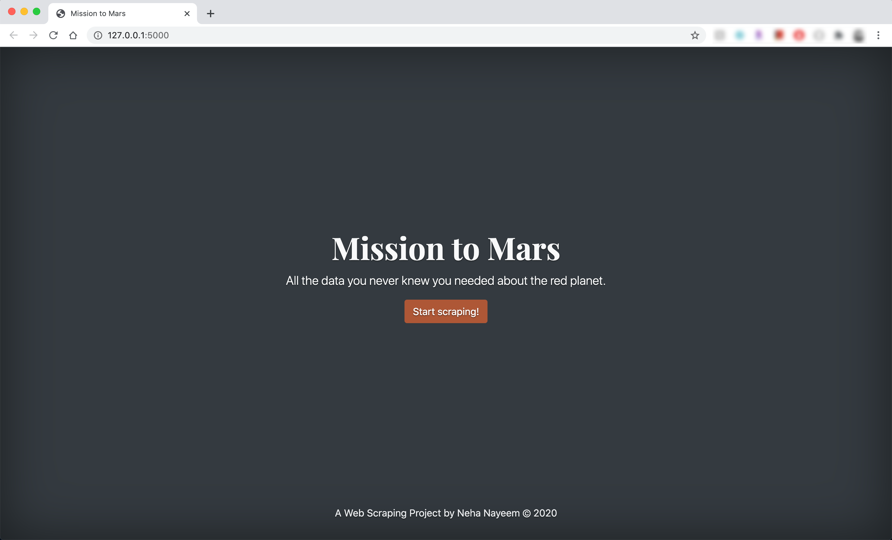

# web-scraping-challenge: Mission to Mars

## Background
In this assignment, the ask was to build a web application that scrapes various websites for data related to the Mission to Mars and display the information in a single HTML page. The following outlines the steps taken:

**Step 1: Scraping**

**Step 2: MongoDB and Flask Application**

## Step 1: Scraping

Initial scraping of the following websites was completed using Jupyter Notebook, BeautifulSoup, Pandas, and Requests/Splinter:

* [NASA Mars News Site](https://mars.nasa.gov/news/): 
  * The latest news title 
  * The latest news paragraph text

* [JPL Featured Space Image](https://www.jpl.nasa.gov/spaceimages/?search=&category=Mars): 
  * The image url for the current Featured Space image
  * The title of the current Featured Space image

* [Mars Weather Twitter account](https://twitter.com/marswxreport?lang=en): 
  * the latest Mars weather tweet: this was additionally cleaned up using Pandas to remove newlines

* [Mars Facts](https://space-facts.com/mars/): 
  * the Mars facts table: Pandas was used to convert the data to a HTML table string

* [USGS Astrogeology](https://astrogeology.usgs.gov/search/results?q=hemisphere+enhanced&k1=target&v1=Mars): 
  * The full-resolution image url of each hemisphere
  * The title of the hemisphere name
  * The above two were saved into a Python dictionary

## Step 2: MongoDB and Flask Application

MongoDB with Flask templating was used to create a new HTML page that displays all of the information that was scraped from the URLs above. The following tasks were completed:

* The Jupyter notebook was converted into a Python script called `scrape_mars.py` with a function called `scrape` that executes all of the scraping code from above and returns one Python dictionary containing all of the scraped data.

* A root route `/` was created, that simply displays a cover page with a button to begin the initial scraping (index.html).

* A route called `/scrape` was created, that imports the `scrape_mars.py` script and calls the `scrape` function. The return value is stored in Mongo as a Python dictionary. This route redirects to the `/data` route for display.

* A route called `/data` queries the Mongo database and passes the Mars data into an HTML template for display (data.html).

## Screenshots

### Landing page (index.html)

Bootstrap CSS was used to create a landing page with a single button to begin scraping data by calling the `/scrape` route.

### Data display (data.html)

The `/scrape` route redirects to a `/data` route that renders a second html template, created to display the scraped data using Bootstrap and custom CSS.

